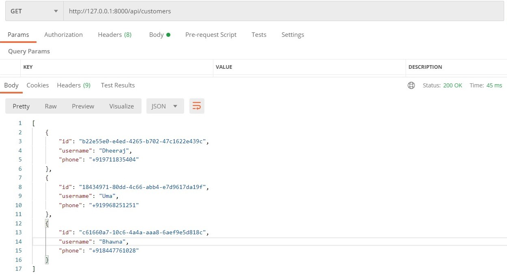

-   ## Add Shows

    ### Request

    `POST /api/addshows/`
    

-   ## Get list of Customers

    ### Request

    `GET /api/customers/`
    

-   ## Get details of customer using Ticket Id 

    ### Request

    `GET /api/customers/<ticketid>`
    

-   ## Get TicketId for the using Show timings

    ### Request

    `GET /api/ticket?time=<%H:%M:%S %Y-%m-%d>`
    

-   ## Book a ticket 

    ### Request

    `POST /api/ticket/`

      

-   ## Delete Ticket using Tid 

    ### Request

    `DELETE /api/ticket/<ticketid>/`
    

-   ## Update Show timings for a given Ticket 

    ### Request

    `PUT /api/ticket/<ticketid>/`
    

-   ## View shows (All/Particular TIme) 

    ### Request

    `GET /api/shows/`

    All Shows

    

    Shows by time

    
